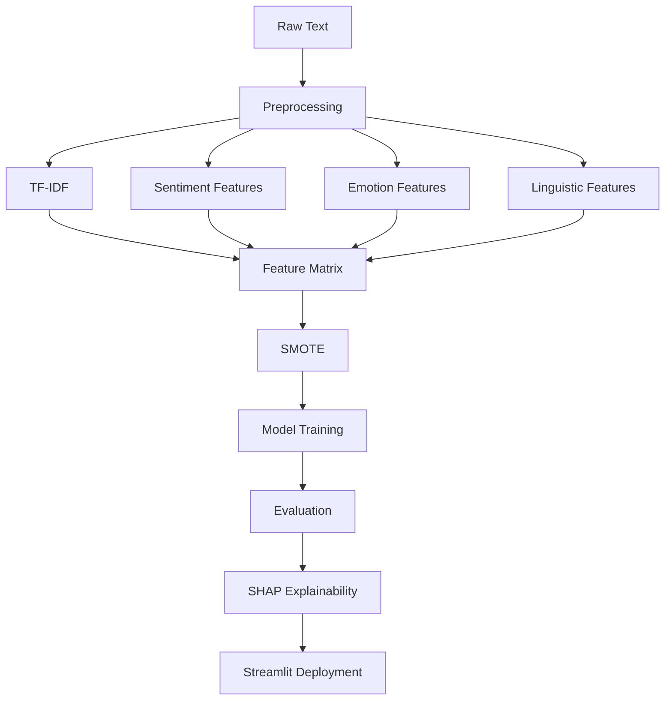
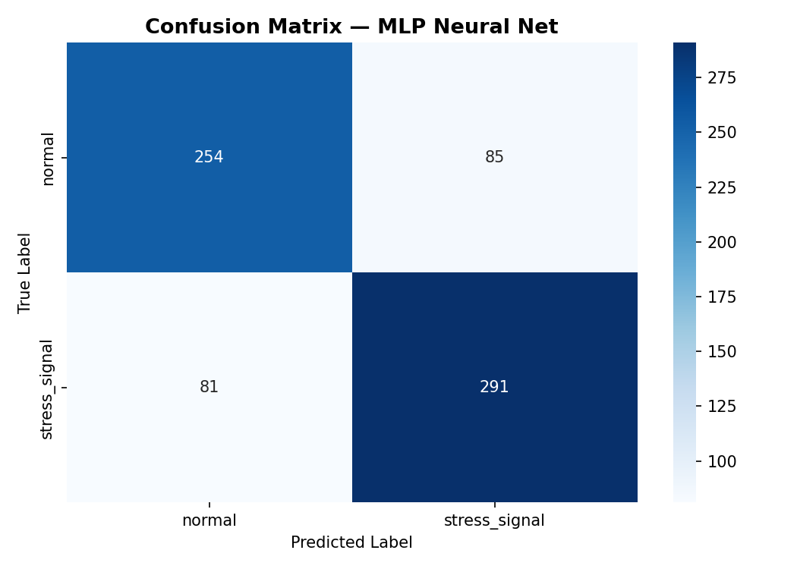
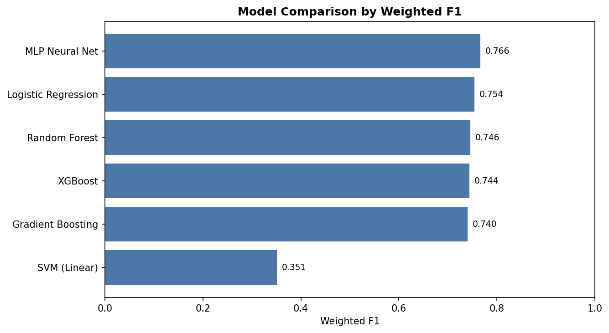
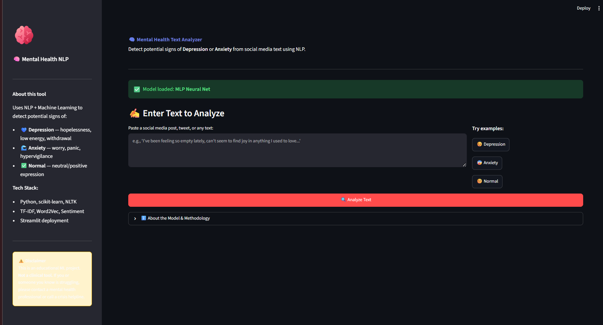
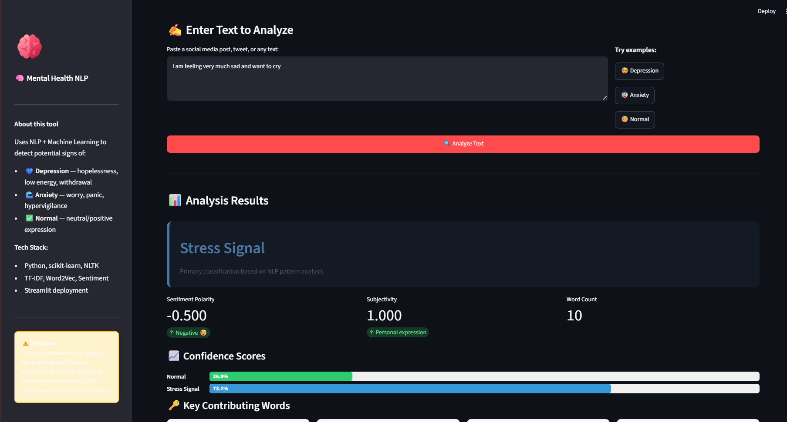

# Explainable Mental Health Text Classification using NLP

This repository implements a supervised NLP classification pipeline for detecting mental health related signals in social media text. The project focuses on classical machine learning, feature engineering, model comparison, error analysis, and interpretability rather than chatbot or generative AI functionality.

## Overview

The project combines TF-IDF features with sentiment, emotion lexicon, and linguistic pattern features to train and evaluate multiple machine learning classifiers. It includes an end-to-end training script, reproducible result export, SHAP-based explainability, and a Streamlit demo for model inference.

The original synthetic dataset generator is retained for educational use. For portfolio and evaluation credibility, the repository now supports a real-world dataset workflow using Dreaddit, a Reddit stress detection dataset.

## Problem Statement

Mental health related language on social media can be subtle, noisy, and emotionally complex. The goal of this project is to classify short text posts into mental health related categories using interpretable NLP and machine learning methods.

This project studies:

- How classical NLP features perform on social media mental health text
- Which models are strongest for sparse high-dimensional text features
- How class imbalance affects recall and F1 score
- Which words and engineered features influence predictions
- What types of text are commonly misclassified

## Dataset

The recommended real-world dataset path is Dreaddit:

- Paper: Dreaddit: A Reddit Dataset for Stress Analysis in Social Media
- Source used by this project: Hugging Face dataset mirror
- Task format: binary stress signal classification
- Processed schema: `text`, `label`, `label_name`, `source`

Download and prepare the dataset:

```bash
python scripts/download_dataset.py --dataset dreaddit
```

The script writes:

```text
data/raw/dreaddit_train.csv
data/raw/dreaddit_validation.csv
data/raw/dreaddit_test.csv
data/raw/dreaddit_merged.csv
data/processed/mental_health_dataset.csv
```

If no real dataset is found, `notebooks/train_pipeline.py` falls back to `data/generate_dataset.py`. The synthetic generator remains useful for demonstrating the pipeline, but real dataset results should be used for resume, GitHub, and Kaggle presentation.

## NLP Pipeline



## Feature Engineering

The final feature matrix combines:

- TF-IDF unigrams and bigrams
- Word2Vec representation comparison
- TextBlob sentiment polarity and subjectivity
- Linguistic features such as word count, character count, punctuation density, capitalization ratio, and lexical diversity
- Emotion lexicon scores for sadness, fear/anxiety, anger, joy, and disgust
- Linguistic pattern features such as absolutist language, hedging, first-person ratio, and negation ratio

## Models Evaluated

The training pipeline evaluates:

- Logistic Regression
- Complement Naive Bayes
- Linear SVM
- Random Forest
- Gradient Boosting
- XGBoost
- Multi-Layer Perceptron

Models are compared using stratified train/test evaluation and cross-validation.

## Results

Run the training pipeline:

```bash
python notebooks/train_pipeline.py
```

Generated result files:

```text
results/leaderboard.csv
results/model_comparison.csv
results/feature_comparison.csv
```

The leaderboard includes model name, accuracy, weighted precision, weighted recall, weighted F1, macro F1, cross-validation F1, and training time. Metrics are intentionally generated from the current dataset and environment instead of being hard-coded in the README.

## Visualizations

The training pipeline writes portfolio-ready visuals to:

```text
assets/images/confusion_matrix.png
assets/images/model_comparison.png
assets/images/feature_importance.png
assets/images/shap_summary.png
```

After running the pipeline, these images are displayed below.

### Confusion Matrix



### Model Comparison


##  Application Screenshots

### Home Page



### Prediction Example




Detailed error analysis is documented in [docs/error_analysis.md](docs/error_analysis.md).

The analysis focuses on:

- False positives where emotionally intense but non-risk text is flagged
- False negatives where distress is expressed indirectly
- Confusion between stress, sadness, anxiety, and general negative sentiment
- Class overlap caused by short posts, sarcasm, and mixed emotional states

## Explainability

The project includes multiple interpretability methods:

- Logistic Regression coefficients for class-specific lexical signals
- Random Forest feature importance for engineered feature inspection
- SHAP summaries for global feature attribution
- Prediction-level feature contribution display in the Streamlit app

Explainability is especially important for sensitive-domain NLP. The model should be treated as a research artifact and not as a diagnostic tool.

## Streamlit Demo

Train the model first:

```bash
python notebooks/train_pipeline.py
```

Then launch the app:

```bash
streamlit run app/streamlit_app.py
```

The app loads the saved model, TF-IDF vectorizer, and label names from `models/`.

## Project Structure

```text
Mental-Health-NLP/
├── README.md
├── requirements.txt
├── app/
│   └── streamlit_app.py
├── assets/
│   └── images/
├── data/
│   ├── generate_dataset.py
│   ├── raw/
│   └── processed/
├── docs/
│   ├── error_analysis.md
│   └── resume_bullets.md
├── models/
├── notebooks/
│   ├── Mental_Health_Detection_NLP.ipynb
│   └── train_pipeline.py
├── results/
├── scripts/
│   └── download_dataset.py
└── src/
    ├── explainability.py
    ├── features.py
    ├── models.py
    ├── nlp_enhancements.py
    └── preprocess.py
```

## Future Improvements

- Evaluate transformer baselines such as DistilBERT or MentalBERT after establishing classical ML baselines
- Add dataset cards and model cards for responsible documentation
- Add calibration analysis for model confidence
- Add fairness and robustness checks across writing styles and subreddits
- Improve error analysis with manually reviewed misclassified examples
- Add CI checks for formatting and smoke-test training on a small sample

## Ethical Considerations

This project is for educational and research purposes only. It is not a clinical screening tool, diagnostic system, or crisis intervention system.

Important limitations:

- Social media text is noisy and context-dependent
- False negatives may miss concerning text
- False positives may overflag ordinary emotional expression
- Dataset bias can affect generalization across communities and demographics
- Any real-world use would require consent, privacy protections, human review, and clinical oversight

The project should be presented as applied NLP classification and explainable machine learning, not as automated diagnosis.
